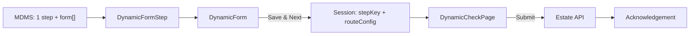
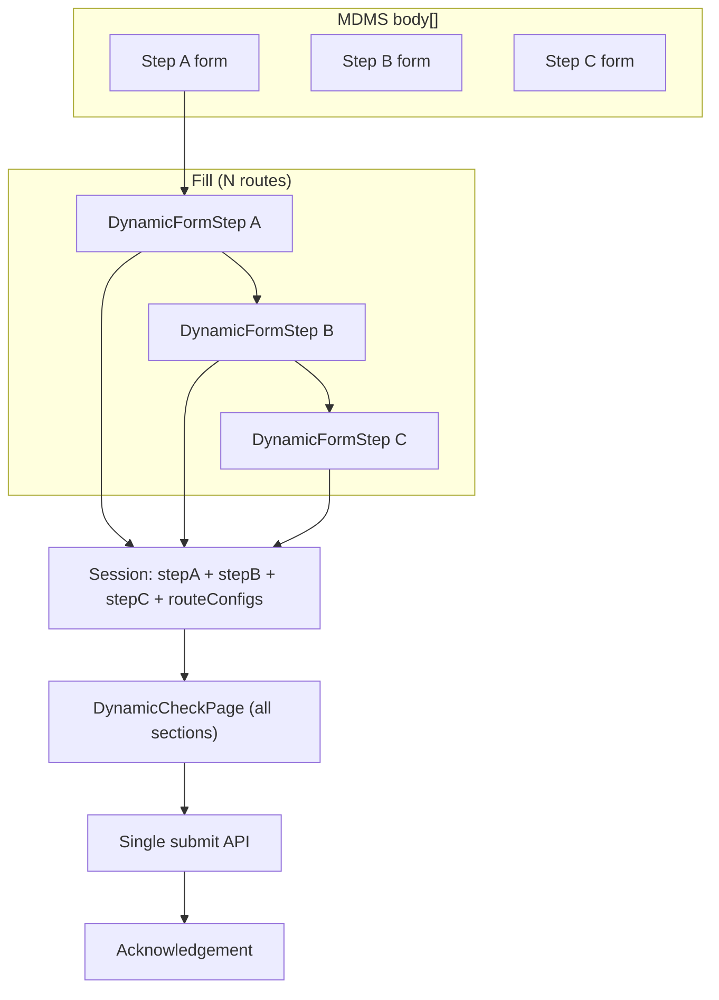

# EST Form Flow — One-step vs Multi-step

Companion to [`DYNAMIC_FORM_FLOW.md`](./DYNAMIC_FORM_FLOW.md).  
Today EST create/assign is mostly **one form step → check → ack**. This doc explains what stays the same and what you add when the form becomes **multi-step**.

---

## Decision: same engine, more routes

| | One-step form (current EST) | Multi-step form |
|--|-----------------------------|-----------------|
| Fill UI | 1× `DynamicFormStep` | N× `DynamicFormStep` (one per route) |
| Config | 1 MDMS step with `form[]` | N MDMS steps, each with own `form[]` + `nextStep` |
| Session | One step key (e.g. `newRegistration`) | One key per step; all merged in session |
| Check | One `DynamicCheckPage` summarizing that step | Same check page — summarize **all** steps (or section per step) |
| Navigation | `Save & Next` → `/check` | `Save & Next` → next step route → … → `/check` |

**Rule:** Do not invent a second form system. Reuse `DynamicForm` / `DynamicFormStep` / `DynamicCheckPage` + MDMS `body[]` steps.

---

## Flow A — One-step (current)



**EST examples**

- Registration: `/newRegistration` → `/check` → `/acknowledgement`  
  (`useEstWizard` with `multiStepNavigation: true`, but only one fill step in MDMS)
- Assign assets: `/assign-assets` → `/check` → `/acknowledgement`  
  (`multiStepNavigation: false`)

---

## Flow B — Multi-step (what to do)

### 1. Split MDMS into ordered steps

In MDMS (e.g. `Estate.NewRegistration` / new master), add multiple `body` entries:

```text
body: [
  { route: "step-a", key: "stepA", component: "ESTStepA", form: [...], nextStep: "step-b" },
  { route: "step-b", key: "stepB", component: "ESTStepB", form: [...], nextStep: "step-c" },
  { route: "step-c", key: "stepC", component: "ESTStepC", form: [...], nextStep: null }  // null → /check
]
```

- Each step owns its own `form[]` (fields, validation, dropdowns).
- `nextStep: null` (or missing string) → wizard goes to **check**.
- Keep Review/preview steps out of employee routes (`ReviewDetails` is already skipped in `buildWizardSteps`).

### 2. Thin React wrapper per step (optional but clear)

```text
PageComponents/ESTStepA.js → <DynamicFormStep config={...} localOverrides={...} onSelect={onSelect} />
PageComponents/ESTStepB.js → same pattern
```

Register components in the EST component registry (same as `ESTNEWRegistration` / `ESTAssignAssets`).

### 3. Wire wizard index (already multi-route capable)

`Create/index.js` already maps `config.map(routeObj → Route)`.  
You mainly:

1. Point MDMS `component` names at the new step wrappers.
2. Keep `useEstWizard({ multiStepNavigation: true, ... })`.
3. Ensure `terminalSegments` includes every step route name + `check` + `acknowledgement`.

### 4. Local overrides (per step or shared)

| File pattern | Role |
|--------------|------|
| `config/estateFormConfig.js` (or split per step) | `staticFields`, `computedFields`, `crossFieldValidations` |
| MDMS | labels, types, order, `visibleWhen`, dropdown masters |

Cross-step rules (e.g. step B needs a value from step A) → read from wizard `formData` / session in the step wrapper or in `computedFields`.

### 5. Check page

- Session already stores each step via `mergeSessionStepWithRouteConfig`.
- Check page must read **all** step keys (or walk `routeConfigs`) and build summary sections.
- One Submit still builds the final API payload from the full session.



### Checklist when adding steps

1. Add MDMS step(s) with `route`, `key`, `form`, `nextStep`, `component`.
2. Add thin `DynamicFormStep` wrapper(s) + registry entry.
3. Add local overrides only for JS behavior.
4. Update `terminalSegments` / index route if needed.
5. Teach check + payload builder about every step key.
6. Keep Cancel / draft / `confirmCancel` opt-in per step as today.

---

## Global functions — needed in BOTH scenarios

These live in shared `react-components` utilities. Use them whether you have 1 or N form steps. Do **not** re-implement in EST.

### Config merge & walking (`formUtils.js` + `checkPageUtils.js`)

| Function | Why both need it |
|----------|------------------|
| `mergeRouteConfig` | MDMS step + local overrides → one `routeConfig` |
| `mergeFormFieldConfigs` | Overlay local field patches onto MDMS `form[]` |
| `flattenFormConfig` | Expand groups into leaf fields |
| `sortByOrder` | Stable field / group order |
| `findFieldConfig` | Lookup one field by name |
| `isFieldVisible` | `hidden` / `visibleWhen` |
| `resolveFieldLabelKey` | Labels / `labelBy` |

### Validation (`validators.js`)

| Function | Why |
|----------|-----|
| `validateFields` | Per-field rules from config |
| `validateCrossField` | Cross-field rules from local overrides |
| `registerFieldRule` / `fieldRules` | Shared rule registry |
| `calculateRentByBillingCycle` | Shared compute (allotment) |

### Prefill / payload (`formUtils.js` + `payloadUtils.js`)

| Function | Why |
|----------|-----|
| `buildInitialData` | Hydrate form from API / edit asset |
| `buildPayload` | Flatten values into wizard session shape |
| `buildApiPayload` | Map flat session → API body (`apiFieldName`, files, numerics) |
| `toDropdownOption` / `resolveOption` / `enrichDropdownSelection` / `optionCode` | Canonical dropdown shape |
| `rehydrateBillingCycleOption` | Restore billing-cycle object from session |
| `formatDateForApi` / `extractFileStoreId` / `getRequestInfo` | API envelope helpers |

### Wizard session & check (`checkPageUtils.js`)

| Function | Why |
|----------|-----|
| `attachRouteConfigToStepData` | Stamp `__routeConfig` on step data (DynamicFormStep) |
| `mergeSessionStepWithRouteConfig` | Persist step + `routeConfigs` map (useEstWizard `handleSelect`) |
| `resolveActiveRouteConfig` / `resolveRouteConfigFromSteps` | Rehydrate config on check / edit |
| `extractWizardFormValues` | Flat values from session for a step |
| `buildSummarySections` / `flattenForSummary` / `resolveSummaryFieldValue` | Check-page UI |
| `collectFormFileEntries` / `resolveFilePreviewUrl` | File summary / preview |

### Dates / UX (`formUtils.js`)

| Function | Why |
|----------|-----|
| `toDate` / `toInputDate` | DatePicker / inputs |
| `scrollToFirstError` | After failed validation |

### EST wizard shell (module-level, still shared across 1-step and multi-step)

| Function / hook | File | Why |
|-----------------|------|-----|
| `useEstWizard` | `utils/useEstWizard.js` | Session, `handleSelect`, check success/error, ack |
| `buildWizardSteps` | `utils/estWizardUtils.js` | Flatten MDMS `body[]` → routable steps |
| `createWizardGoNext` | `utils/estWizardUtils.js` | Navigate next step or `/check` |
| `getWizardBasePath` | `utils/estWizardUtils.js` | Base path for ack / check |

---

## Extra only for multi-step

| Concern | Approach |
|---------|----------|
| Step order / branching | MDMS `nextStep` (+ optional skip via `skipStep` in `onSelect`) |
| Back / edit from check | Jump to that step’s `route`; session already has values |
| Cross-step visibility / compute | Read earlier keys from `formData` / `params` |
| Check summary | Loop steps → `buildSummarySections` per step’s `routeConfig.form` |
| Final API payload | Merge all step flats (or nest by `payloadKey`) once on Submit |
| Progress UI (optional) | Timeline / stepper driven by `config` from `buildWizardSteps` |

Nothing new is required inside `DynamicForm` itself for multi-step — each step is still one form page.

---

## Memory tip

```text
ONE-STEP:   MDMS[1] → DynamicFormStep → session[1] → Check → API
MULTI-STEP: MDMS[N] → DynamicFormStep×N → session[N] → Check → API

Same globals: mergeRouteConfig, validate*, buildPayload / buildApiPayload,
              mergeSessionStepWithRouteConfig, buildSummarySections, useEstWizard
```

**DynamicForm** = one page of fields.  
**Multi-step** = several pages of DynamicForm, chained by MDMS `nextStep`, one shared check + submit.
